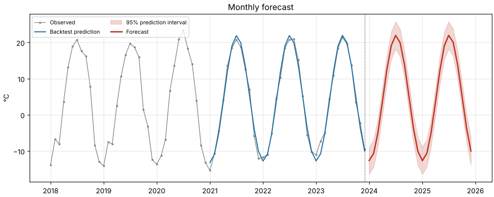
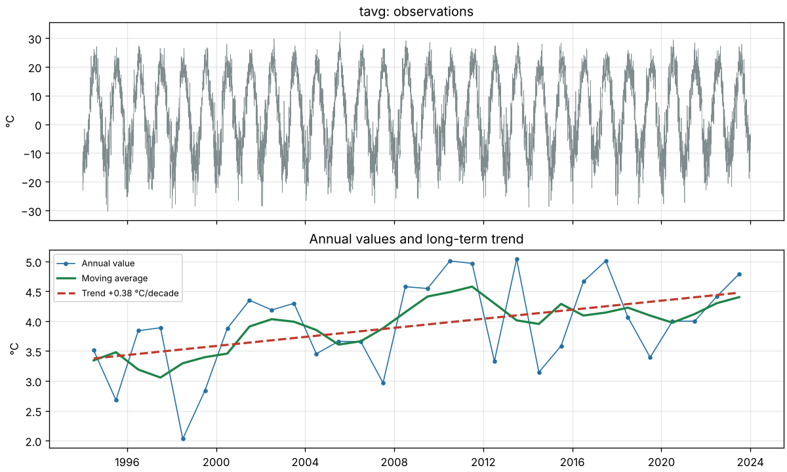
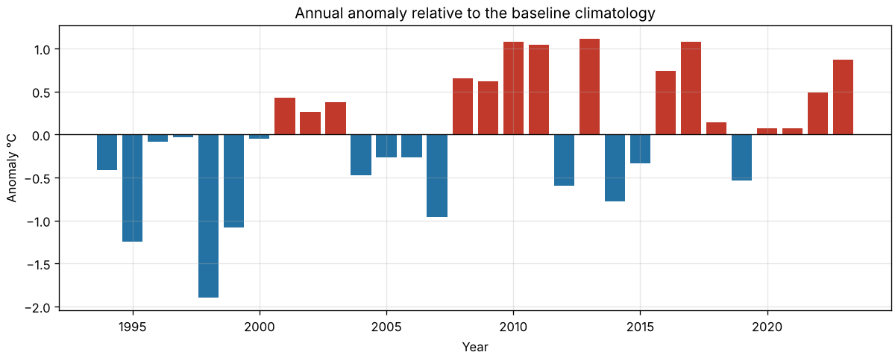

# climate-analyzer

[](https://github.com/a169n/applied_software_3/actions/workflows/ci.yml)
[](https://github.com/a169n/applied_software_3/actions/workflows/astana-forecast.yml)
[](pyproject.toml)
[](LICENSE)

A small scientific tool that **cleans daily weather data, analyses long-term
climate change and forecasts the coming months**. The case study is
**Astana, Kazakhstan**, a city with one of the most continental climates of any
capital in the world (January ≈ −14 °C, July ≈ +21 °C).

It is usable as a command line tool, a minimal web UI and a Python library.



## Features

| Step | What it does |
|---|---|
| **Load** | Reads any CSV with a date column. Detects the date column, converts `-999`-style sentinels to missing values, sorts and de-duplicates. |
| **Fetch** | Downloads real daily history for Astana (or any coordinates) from the free [Open-Meteo](https://open-meteo.com) archive. |
| **Clean** | Removes outliers relative to the *same calendar month* (z-score or IQR). Interpolates short gaps and keeps long gaps missing so they are not invented. |
| **Analyse** | Monthly/annual aggregation with coverage checks, OLS trend, Mann-Kendall test with Sen's slope, climatology, anomalies, seasonal decomposition and warm/cold extreme-day counts. |
| **Model & forecast** | Trend + annual harmonics + AR(1) model, forecasts with 95 % prediction intervals, and a hold-out backtest scored against the climatology baseline. |
| **Report** | Markdown and JSON reports, CSV tables and PNG figures. |

## Quick start

```bash
git clone https://github.com/a169n/applied_software_3.git
cd applied_software_3
python -m venv .venv && source .venv/bin/activate   # Windows: .venv\Scripts\activate
pip install -e ".[ui]"          # or ".[dev]" for the test/lint tools too
```

### Command line

```bash
# Analyse the bundled (synthetic) Astana dataset, offline
climate-analyzer analyze sample --baseline 1994 2013 -o results

# Download real Astana data (1994 to last year) and analyse it
climate-analyzer fetch --city astana -o data/astana.csv
climate-analyzer analyze data/astana.csv --baseline 1994 2013 -o results/astana

# Precipitation is summed rather than averaged; skewed data, so no outlier removal
climate-analyzer analyze data/astana.csv -c prcp -u mm --outliers none -o results/prcp
```

`climate-analyzer analyze --help` lists all options: outlier method, gap
length, smoothing window, forecast horizon and backtest length.

Output folder:

```
results/
├── report.md          # human-readable report
├── summary.json       # all numbers, machine-readable
├── annual.csv         # annual values and anomalies
├── forecast.csv       # monthly forecast with 95 % interval
├── trend.png  anomalies.png  climatology.png
└── decomposition.png  extremes.png  forecast.png
```

### Web UI

```bash
streamlit run app.py
```

In the sidebar, pick the offline Astana sample, the real Astana data from
Open-Meteo, or upload your own CSV. Then adjust the cleaning, baseline and
forecast settings. Each analysis has its own tab, and the report can be
downloaded.

### Python library

```python
from climate_analyzer import AnalysisConfig, load_sample, run_analysis

result = run_analysis(load_sample(), AnalysisConfig(column="tavg", baseline=(1994, 2013)))
print(result.trend.slope_per_decade, result.trend.mann_kendall_p_value)
print(result.forecast.head())
print(result.to_markdown())
```

## Input format

Any CSV with one row per day, a date column (`date`, `time`, `datetime`,
`timestamp` or `day`; otherwise pass `--date-column`) and numeric columns:

```csv
date,tavg,tmin,tmax,prcp
1994-01-01,-13.3,-17.4,-9.2,0.0
```

## Methods

- **Outliers**: a value is flagged when it lies more than 4 standard deviations
  (or 3 IQR) from the values of the same calendar month. A global threshold
  would treat every Astana winter day as an outlier.
- **Coverage**: a month (or year) with less than 80 % of its days observed is
  excluded, so a month with five measured days cannot distort the trend.
- **Trend**: ordinary least squares on annual values, together with the
  non-parametric **Mann-Kendall** test and **Sen's slope**, the standard
  robust method in climatology. Significance is judged at p < 0.05.
- **Anomalies**: deviation from the mean of a user-chosen baseline period
  (WMO practice uses a 30-year normal such as 1991-2020).
- **Extremes**: days above the 90th / below the 10th percentile of the
  baseline for the same calendar month (similar to ETCCDI TX90p/TN10p).
- **Forecast model** (monthly):
  `y(t) = b0 + b1·t + Σk [ak·cos(2πkt) + ck·sin(2πkt)] + r(t)`, with
  `r(t) = φ·r(t−1) + ε(t)`. The prediction interval widens with the horizon
  as the AR(1) memory decays. Accuracy is measured on the last 36 months held
  out from fitting, against the *climatology* forecast ("an average January").

On the bundled sample, which has a built-in warming of +0.35 °C/decade, the
tool finds **+0.38 ± 0.15 °C/decade** (Mann-Kendall p = 0.02). The forecast
model beats climatology by about 9 % in mean absolute error.

## Project structure

```
├── app.py                         # Streamlit web UI
├── src/climate_analyzer/
│   ├── io.py                      # CSV loading and validation
│   ├── sources.py                 # Open-Meteo downloader
│   ├── cleaning.py                # outliers, gap filling
│   ├── analysis.py                # trends, climatology, decomposition, extremes
│   ├── forecast.py                # statistical model, forecast, backtest
│   ├── pipeline.py                # end-to-end analysis + reports
│   ├── plotting.py                # matplotlib figures
│   ├── cli.py                     # command line interface
│   └── data/astana_daily_sample.csv
├── scripts/generate_sample_data.py
├── tests/                         # pytest suite (84 tests, ~98 % coverage)
├── docs/TECHNOLOGY.md             # justification of the chosen technologies
└── .github/                       # CI/CD workflows, issue and PR templates, Dependabot
```

## CI/CD (GitHub Actions)

| Workflow | Trigger | Jobs |
|---|---|---|
| [`ci.yml`](.github/workflows/ci.yml) | every push / pull request | Ruff lint + format check, mypy, pytest on Ubuntu (Python 3.10-3.13), Windows and macOS. Then an end-to-end analysis of the Astana sample (report shown in the job summary and kept as an artifact) and a package build with an install check. |
| [`astana-forecast.yml`](.github/workflows/astana-forecast.yml) | monthly schedule, manual | Downloads the latest real Astana data, runs the temperature and precipitation analysis and forecast, and publishes the reports as a job summary and artifact. |
| [`release.yml`](.github/workflows/release.yml) | tag `v*` | Checks that the tag matches the package version, runs the tests, builds the package and creates a GitHub Release with the wheel and sdist. |

Run the same checks locally:

```bash
pip install -e ".[dev]"
ruff check . && ruff format --check . && mypy && pytest --cov
```

<p>
  
  
</p>

## Data sources and limitations

- The **bundled sample is synthetic**. It imitates Astana's climate and
  contains deliberate defects (gaps, sensor spikes, `-999` codes) so that the
  cleaning step can be tested. Regenerate it with
  `python scripts/generate_sample_data.py`. Use `fetch` for real data.
- Open-Meteo data is **ERA5 reanalysis** on a grid of about 25 km. It
  describes the city area, not a single weather station.
- The forecast is **statistical**: it extrapolates the trend, the seasonal
  cycle and short-term persistence. It cannot predict individual weather
  events and is no substitute for a numerical weather model.
- Residual variance is assumed constant across seasons, although Astana
  winters are more variable than summers.

## License and citation

MIT, see [LICENSE](LICENSE). Citation metadata is in [CITATION.cff](CITATION.cff).
Contributions are welcome, see [CONTRIBUTING.md](CONTRIBUTING.md).
